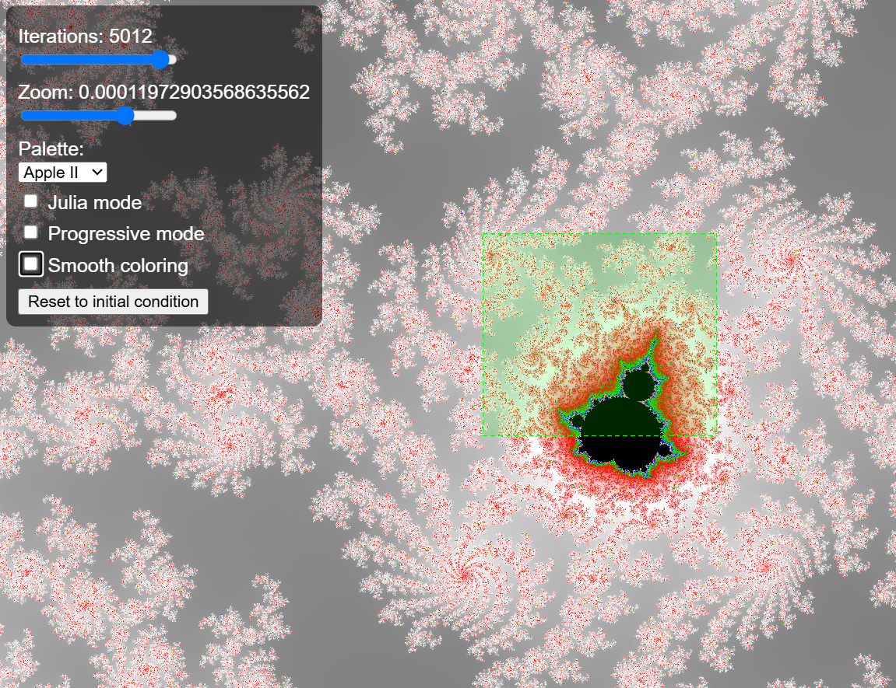
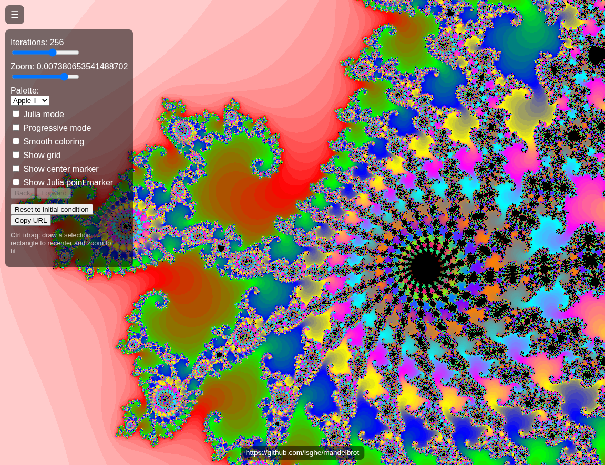

# WebGPU Mandelbrot / Julia Fractal

[](https://github.com/isghe/mandelbrot/actions/workflows/ci.yml)

Real-time Mandelbrot and Julia set renderer using the WebGPU API, with double-single
precision arithmetic in the shader for deep zooms (~1e-13/1e-14).

**Live demo:** [isghe.github.io/mandelbrot](https://isghe.github.io/mandelbrot/)



- **Real-time WebGPU rendering** — the whole Mandelbrot/Julia iteration runs on the GPU,
  panning and zooming at interactive framerates.
- **Deep zoom** via double-single precision arithmetic in the shader, pushing past the
  ~1e-7 wall of native `f32` down to ~1e-13/1e-14.
- **Interactive Julia panel** — click anywhere on the Mandelbrot set to pin the
  corresponding Julia set; show it side by side with the Mandelbrot set, or on its own.
- **Curated landmarks menu** — jump straight to well-known points of interest (the
  cusp, Seahorse Valley, the Feigenbaum point, ...) without hunting for them by hand,
  with an optional overlay marking all of them at once.
- **Shareable view URLs** — copy a link that reproduces the exact view, iterations,
  palette, and mode you're looking at.

  Example: [Open the spiral view](https://isghe.github.io/mandelbrot/?mx=-0.7445137502875607&my=0.16445045543801942&mscale=0.007380653541488702&v=7)

  

More notable views: [examples/examples.md](examples/examples.md)

## Running

Serve the directory over `http://` or `https://` and open `index.html`:

```sh
python -m http.server
```

Then visit `http://localhost:8000/`.

`file://` will not work: the app uses a `type="module"` script with top-level `await`,
and it `fetch()`s the shader source at startup, both of which require an HTTP origin.

Requires a WebGPU-capable browser. Support varies by browser and platform:

- **Chrome / Edge / Brave** (and other Chromium-based browsers) — broadest support,
  enabled by default on desktop (Windows, macOS, ChromeOS, Linux) since 2023; also
  available on Android.
- **Firefox** — supported on Windows since late 2025; other platforms (macOS, Linux) are
  still catching up and may require enabling it manually in `about:config`.
- **Safari** — supported since Safari 18 (2024) on macOS and iOS; coverage is newer and
  some edge cases may behave differently than on Chromium-based browsers.

If the page shows a "WebGPU is not supported" error, try updating your browser or
switching to a recent Chromium-based release (Chrome, Edge, Brave).

At very deep zooms combined with a high iteration count, a single frame can take long
enough to compute that the OS/driver's GPU watchdog (e.g. Windows TDR) kills the device,
which surfaces as a **"WebGPU device lost"** error with a reload prompt. If the adapter
also fails to come back right after reloading ("No WebGPU adapter available"), that's
usually the GPU driver still recovering from the crash — try reloading again after a
minute. Since the URL still points at the same deep zoom/iteration count that caused the
crash, also try **Reset to initial condition** (it works even without a live renderer) to
clear that state before dialing the iteration count back up more gradually.

## Controls

- **☰ button** (top-left) — hide/show the settings panel for an unobstructed view of the
  fractal. Also toggleable with the **H** key.
- **Repo link** (bottom-center) — links back to this GitHub repository.
- **Drag** — pan the view.
- **Click** (without dragging) — set the zoom pivot point, and also set the Julia seed
  (regardless of mode, so it can be picked while still viewing the Mandelbrot set).
- **Scroll wheel** — zoom in/out, centered on the last pivot point.
- **Ctrl+drag** — draw a selection rectangle; releasing recenters and zooms to fit it.
- **Mandelbrot** / **Julia** checkboxes — independently show/hide each panel (both on,
  split screen, by default). Both on shows them side by side, each with its own
  independent pan/zoom; either alone shows that panel full-screen; both off is a black
  screen. The Julia panel always renders the set for the current pivot-selected seed.
- **Progressive mode** checkbox — reveal the fractal iteration by iteration instead of
  jumping straight to full quality.
- **Smooth coloring** checkbox (off by default) — continuous escape-time coloring instead
  of the classic per-iteration banded look.
- **Show grid** checkbox (off by default) — overlay a cartesian grid with "nice number"
  spaced gridlines and brighter x=0/y=0 axes.
- **Show center marker** checkbox (off by default) — overlay a crosshair at the current
  view center.
- **Show Julia seed marker** checkbox (off by default) — overlay a diamond at the current
  Julia seed, in either mode.
- **Show landmarks** checkbox (off by default, Mandelbrot panel only) — overlay a small
  cyan marker at each curated point from the Landmarks menu below, so you can see at a
  glance where they sit relative to the current view. Purely visual: the menu remains the
  only way to actually jump to one; markers outside the current pan/zoom simply don't
  appear.
- **Back / Forward** buttons — step through the view history (center, zoom, iterations,
  palette, Julia seed, progressive mode, smooth coloring). Continuous wheel-zoom
  and slider drags each count as a single history step. The grid/marker/landmarks
  checkboxes and the Mandelbrot/Julia panel-visibility checkboxes above are display
  preferences, not view state, and are not part of this history — panning/zooming the
  Julia panel independently is likewise not undoable.
- **Reset to initial condition** button — restore the default view, iterations, palette,
  Julia seed, progressive mode, smooth coloring, the grid/marker/landmarks overlay
  checkboxes (unchecked), and panel visibility (both panels shown, split screen) — even though none of
  these are part of the Back/Forward history. Also clears the Back/Forward history. Note
  this also overwrites the persisted settings below with these defaults, once the next
  render fires.
- Iteration count and zoom level are adjustable via log-scale sliders (for precise control
  at both the low and deep-zoom ends of their range), plus **-1 / +1** buttons next to the
  iteration slider for single-step adjustments; palette is also adjustable via the UI
  panel.
- **Landmarks** menu (Mandelbrot panel only) — jump straight to a curated point of interest
  (e.g. the main cardioid cusp, Seahorse Valley, the Feigenbaum point), keeping the current
  zoom and iteration count. Counts as a single Back/Forward history step, like a click. The
  menu resets to its placeholder after each jump; it isn't part of Copy URL/localStorage,
  since it's a one-shot action rather than persisted state.
- **Copy URL** button — copy a link to the clipboard that reproduces the current view,
  iterations, palette, Julia seed, the Julia panel's own independent pan/zoom,
  progressive mode, smooth coloring, grid/marker/landmarks overlay checkboxes, and
  Mandelbrot/Julia panel visibility. Only fields that differ from the app's built-in
  defaults are encoded, so the address bar also updates live as you interact and
  collapses back to a bare URL after **Reset to initial condition**.

All of the above (view, iterations, palette, Julia seed, the Julia panel's own
pan/zoom, progressive mode, smooth coloring, the grid/marker/landmarks overlay
checkboxes, and Mandelbrot/Julia panel visibility) is persisted to `localStorage` and restored on the
next page load, so the app reopens where you left it. Settings-panel visibility (the ☰
toggle / **H** key) is a session-only preference and is not persisted.

Opening a URL with share parameters (`?mx=...&my=...&mscale=...&v=7`, etc.) always takes
precedence over `localStorage`. Param names have been renamed as the app grew, gated on
`v`: the pan/zoom names `mx`/`my`/`mscale` (and Julia's `sx`/`sy`) need `v` ≥ 3 — Julia's
own `jscale` has always used that name; the Mandelbrot quality/look/overlay names
`miter`/`mpalette`/`mprogressive`/`msmooth`/`mgrid`/`mcenterMark` need `v` ≥ 6 — their
Julia counterparts `jiter`/`jpalette`/`jprogressive`/`jsmooth`/`jgrid`/`jcenterMark` have
always used this prefix. Older links
using the pre-rename `?iter=...&palette=...` (Mandelbrot) or `?x=...&y=...&scale=...`
names, with a lower or absent `v=`, still work: any field present in the URL is applied,
and any field *not* present falls back to the app's built-in defaults, not to whatever was previously
saved locally in that browser. In other words, a partial share link is not merged with
your existing local settings — it's applied against a clean slate.

One exception to "falls back to the app's built-in defaults": panel visibility
(`mandelbrot`/`julia`). The app's own default changed from Mandelbrot-only to both panels
shown (split screen) in `v` 7, so an absent `mandelbrot`/`julia` in a `v` < 7 link still
resolves to the *old* default (Mandelbrot-only) rather than today's, so links shared
before that change keep opening the exact view they captured. Only `v` ≥ 7 links defer
an absent visibility param to the app's current (split-screen) default.

## Palettes

The fractal shader runs in two passes: an iterate pass computes each pixel's
escape data (how many iterations it took to leave the set, or that it never
did) and writes it to an offscreen target; a colorize pass reads that data
back and maps it through the current palette onto the canvas. Escape data
doesn't depend on the palette, so switching palettes — or toggling smooth
coloring — recolors the whole view from what's already there instead of
recomputing the fractal: instant regardless of zoom depth or iteration count.

Every palette is a 256x2 texture: row 0 holds the 256-entry color lookup
table for escaped points, row 1 holds a solid interior color for points that
never escape (black by default). Palettes come in two kinds, picked from the
same dropdown menu (grouped by `<optgroup>`):

- **Gradient** — row 0 is a continuous color lookup table, sampled at
  `t = iterations / maxIterations`. Colors blend smoothly as the iteration
  count rises.
- **Banded** — row 0's colors are assigned by exact iteration class
  (`iterations % bandCount`) rather than interpolated, so a point's color
  depends only on which "band" its escape iteration falls into, not on
  `maxIterations`. Smooth coloring is disabled automatically when a banded
  palette is selected, since the two are incompatible.

See `src/palette.js` (`PALETTE_GROUPS`) for the current list of palettes and
their colors — the single source of truth for both the dropdown menus and
this section.

## Testing

The app itself is **vanilla JS with no build step** — `package.json` and the
`devDependencies` below exist only to run the end-to-end test suite during
development; they are not required to run or serve the app (see "Running" above).

```sh
npm install
npm test
```

This runs a [Playwright](https://playwright.dev/) suite (`tests/`) that drives a
real headless browser against the app: pan, wheel-zoom, palette/Julia/progressive/
smooth toggles, the landmarks jump menu, the Back/Forward view history, and the
grid/marker overlay checkboxes.
It launches Chromium with software rendering flags (SwiftShader) so WebGPU works in
headless/CI environments without a real GPU.

Pure-logic helpers (`src/geometry.js`, `src/precision.js`) also have a fast, browser-free unit
test suite using Node's built-in test runner:

```sh
npm run test:unit
```

`npm run test:all` runs both suites.

## Verification

Commits in this repository are GPG-signed and anchored with
[OpenTimestamps](https://opentimestamps.org/) proofs embedded directly in the commit
objects. The signing key fingerprint is `0F11E7FD 81B2D24A D6C1C75F 8E8FEE26 37C508B1`.

Note: `git log --show-signature` may report some commits as unverified depending on your
local OpenTimestamps tooling/network access (e.g. whether a Bitcoin node is reachable) —
this reflects local verification tooling quirks, not the underlying commit signatures,
which can be confirmed independently via `git cat-file -p <commit>`. This is caused by a
bug in `ots-git-gpg-wrapper`'s handling of Bitcoin RPC connection failures; a fix is
proposed in [opentimestamps-client#166](https://github.com/opentimestamps/opentimestamps-client/pull/166)
and should resolve this once merged upstream.
