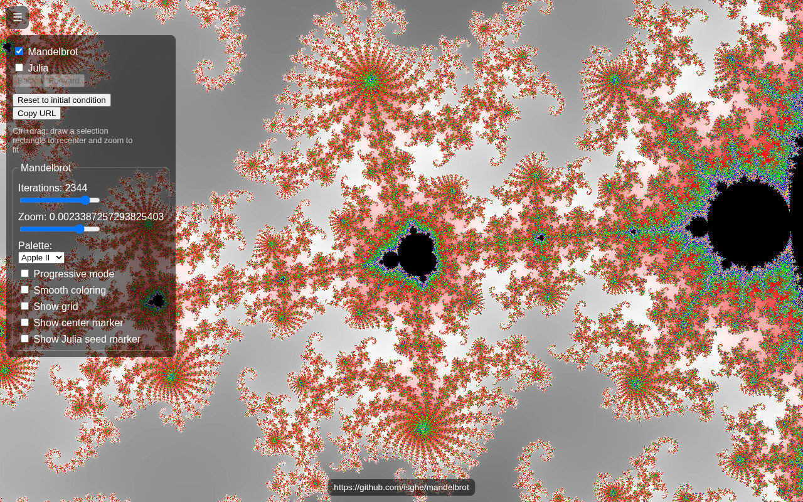
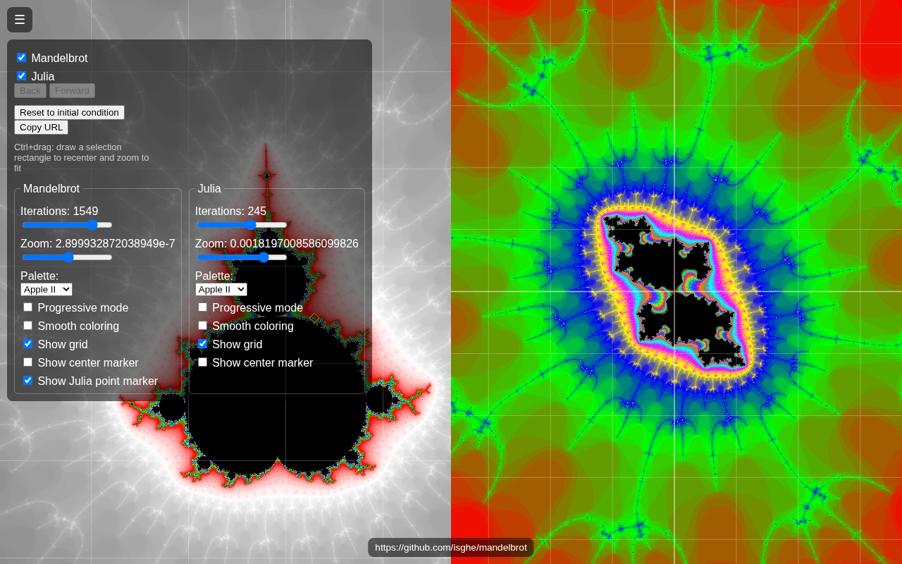
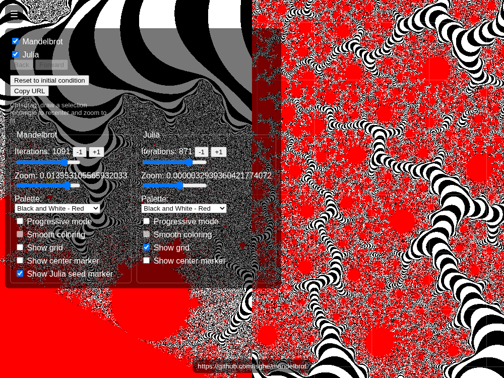

# Notable examples

Live share-URLs into the [demo](https://isghe.github.io/mandelbrot/) worth revisiting.

## Deep zoom, Mandelbrot only

Pubblicato: 2026-08-06 16:42:38

https://isghe.github.io/mandelbrot/?mx=-0.738796021540667&my=0.16423594565505903&miter=2344&mscale=0.0023387257293825403&julia=0&v=7

## Dual-panel view (Mandelbrot + Julia, grid on)

Pubblicato: 2026-08-04 23:55:15

https://isghe.github.io/mandelbrot/?mx=-1.859401731016781&my=-0.001809058061010546&sx=-1.8594016853129103&sy=-0.0018090766053930985&jpx=0.00000675443222884764&jpy=0.00003088196423953486&miter=1549&jscale=0.0018197008586099826&jiter=245&mscale=2.899932872038949e-7&mgrid=1&jgrid=1&juliaMark=1&julia=1&v=7

## Banded palette, dual-panel deep zoom (Black and White - Red)

Pubblicato: 2026-08-09 23:00:57

https://isghe.github.io/mandelbrot/?mx=0.13854302181315678&my=0.5884293175069384&sx=0.13580242204077442&sy=0.5887346225910601&jpx=-0.17354844687299786&jpy=-0.2379314501367211&miter=1091&jscale=0.0000032939360421774072&jiter=871&mpalette=5&jpalette=5&mscale=0.013553105565932033&jgrid=1&juliaMark=1&v=7

## Spiral view

Pubblicato: 2026-08-01 19:06:14

https://isghe.github.io/mandelbrot/?x=-0.7445137502875607&y=0.16445045543801942&scale=0.007380653541488702

